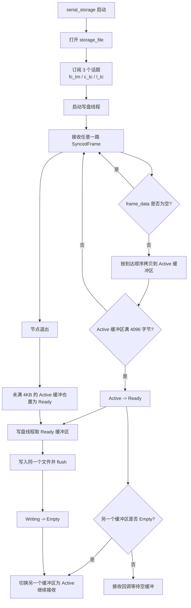

# 双缓存存储流程

这张图描述 `serial_storage` 如何把 3 路已通过目的 ID 过滤的 `frame_data` 写入同一个文件。

```mermaid
flowchart TB
    A[serial_storage 启动] --> B[打开 storage_file]
    B --> C[订阅 3 个话题<br/>fc_tm / c_tc / l_tc]
    C --> D[启动写盘线程]

    D --> E[接收任意一路 SyncedFrame]
    E --> F{frame_data 是否为空?}
    F -- 是 --> E
    F -- 否 --> G[按到达顺序拷贝到 Active 缓冲区]

    G --> H{Active 缓冲区满 4096 字节?}
    H -- 否 --> E
    H -- 是 --> I[Active -> Ready]
    I --> J{另一个缓冲区是否 Empty?}
    J -- 是 --> K[切换另一个缓冲区为 Active<br/>继续接收]
    J -- 否 --> L[接收回调等待空缓冲]

    I --> M[写盘线程取 Ready 缓冲区]
    M --> N[写入同一个文件并 flush]
    N --> O[Writing -> Empty]
    O --> K

    E --> P[节点退出]
    P --> Q[未满 4KB 的 Active 缓冲也置为 Ready]
    Q --> M
```

## 存储约定

- 每个缓冲区大小固定为 `4096` 字节。
- 文件里只保存原始帧字节，不额外插入话题名、长度字段或 ROS 时间戳。
- 三路数据谁先到，谁先进入文件；存储节点不重新排序。
