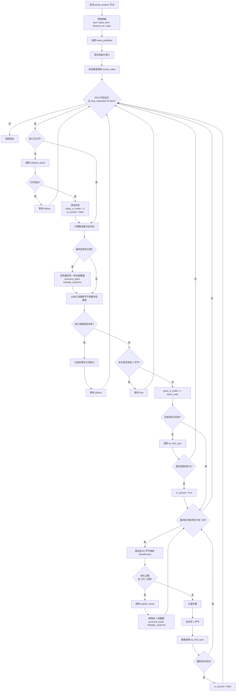

# 帧同步总流程

这张图描述 `receive_data()` 的主流程。

```mermaid
flowchart TB
    A[启动 serial_receiver 节点] --> B[声明参数<br/>port / baud_rate / timeout_ms / topic]
    B --> C[创建 frame_publisher]
    C --> D[尝试初始化串口]
    D --> E[启动接收线程 receive_data]

    E --> F{ROS 仍在运行<br/>且 stop_requested 为 false?}
    F -- 否 --> Z[线程退出]
    F -- 是 --> G{串口已打开?}

    G -- 否 --> H[调用 initialize_serial]
    H --> I{打开成功?}
    I -- 否 --> J[等待 500ms]
    J --> F
    I -- 是 --> K[清空状态<br/>bytes_in_buffer = 0<br/>is_synced = false]
    K --> L[继续接收]

    G -- 是 --> L[计算剩余缓冲区空间]
    L --> M{缓冲区是否已满?}
    M -- 是 --> N[丢弃最旧的一帧长度数据<br/>consume_bytes FRAME_LENGTH]
    N --> O[从串口读取新字节到缓冲区尾部]
    M -- 否 --> O[从串口读取新字节到缓冲区尾部]

    O --> P{串口读取是否异常?}
    P -- 是 --> Q[记录告警并关闭串口]
    Q --> R[等待 200ms]
    R --> F

    P -- 否 --> S{本次是否读到 0 字节?}
    S -- 是 --> T[等待 5ms]
    T --> F
    S -- 否 --> U[bytes_in_buffer += bytes_read]

    U --> V{当前是否已同步?}
    V -- 否 --> W[调用 try_find_sync]
    W --> X{是否找到同步点?}
    X -- 否 --> F
    X -- 是 --> Y[is_synced = true]
    Y --> AA

    V -- 是 --> AA{缓冲区中是否至少有 1 帧?}
    AA -- 否 --> F
    AA -- 是 --> AB[取出前 64 字节组成 SerialFrame]

    AB --> AC{帧头正确<br/>且 CRC 正确?}
    AC -- 是 --> AD[调用 publish_frame]
    AD --> AE[移除这 1 帧数据<br/>consume_bytes FRAME_LENGTH]
    AE --> AA

    AC -- 否 --> AF[记录告警]
    AF --> AG[仅丢弃 1 字节]
    AG --> AH[重新调用 try_find_sync]
    AH --> AI{重新同步成功?}
    AI -- 是 --> AA
    AI -- 否 --> AJ[is_synced = false]
    AJ --> F
```

## 关键点

- 初始同步并不是看到一个 `EB 90` 就算成功
- 必须找到两个间隔正好为 `FRAME_LENGTH` 的连续帧头
- 同步后每次按固定 `64` 字节取帧
- 校验失败时只丢 `1` 字节，避免跳过真实帧头
