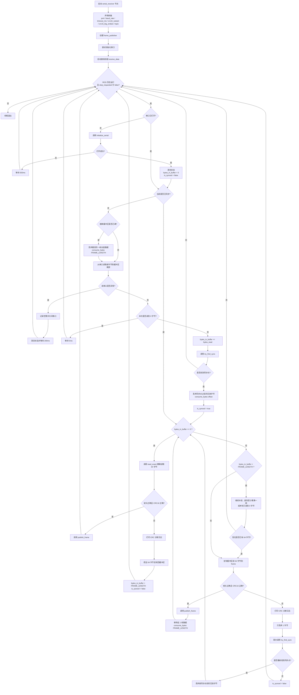

# 帧同步总流程

这张图描述当前 `serial_receiver.cpp` 中 `receive_data()` 的主流程。

## 当前实现的关键点

- 初始同步不是只看一个 `EB 90`，而是必须找到两个相隔 `FRAME_LENGTH` 的帧头
- 同步建立后，会优先把用户态缓冲区里已经读到的残留数据处理完
- 只有当 `bytes_in_buffer == 0` 时，才切换到 `read_exact(..., 64)` 的固定帧长读取模式
- 校验失败时会输出详细 CRC 诊断日志，帮助判断 CRC16 变体和字节序是否配置正确
