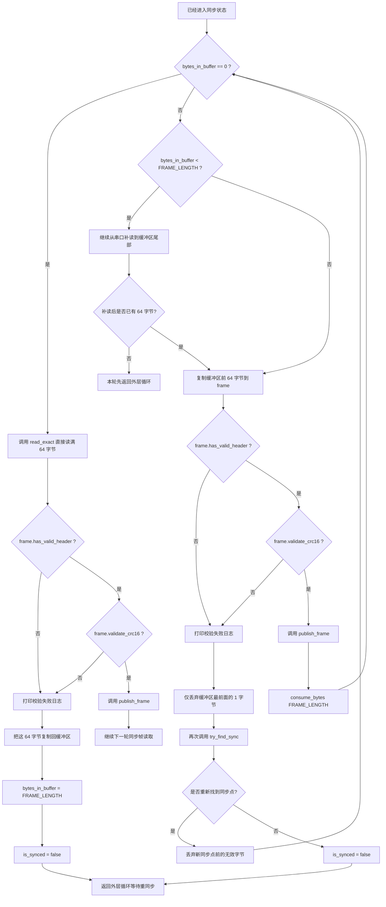

# 已同步后的处理

这张图描述 `is_synced == true` 后的主处理逻辑。

## 当前实现的两个已同步分支

- 分支 1：用户态缓冲为空  
  这时直接调用 `read_exact()` 精确读取 `64` 字节

- 分支 2：用户态缓冲里还有历史残留字节  
  先把缓冲区里的数据补齐并消化完，再决定是否继续保持同步

## 当前校验逻辑

每一帧都会检查两层内容：

- 帧头是否为 `EB 90`
- CRC16 是否与当前配置的 `crc16_variant` 和 `crc16_big_endian` 一致

这也是为什么即使已经同步，仍然不能盲信后续每帧都一定正确。
