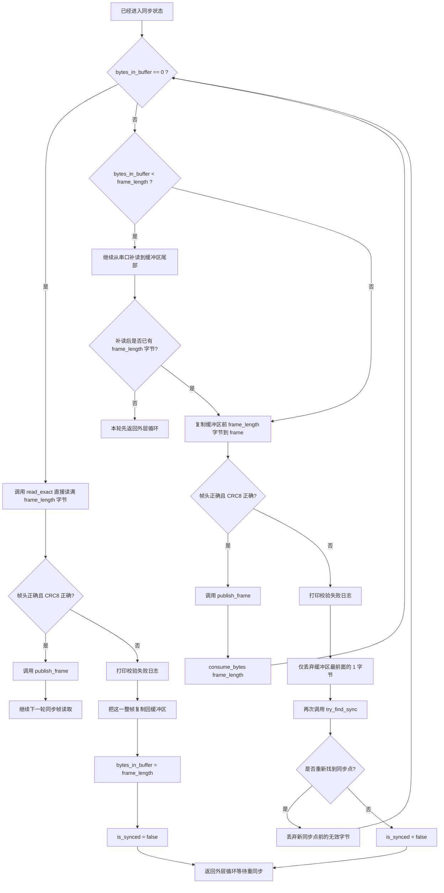

# 已同步后的处理

这张图描述 `is_synced == true` 后的主处理逻辑。

```mermaid
flowchart TB
    A[已经进入同步状态] --> B{bytes_in_buffer == 0 ?}

    B -- 是 --> C[调用 read_exact 直接读满 frame_length 字节]
    C --> D{帧头正确且 CRC8 正确?}
    D -- 是 --> E[调用 publish_frame]
    E --> F[继续下一轮同步帧读取]
    D -- 否 --> G[打印校验失败日志]
    G --> H[把这一整帧复制回缓冲区]
    H --> I[bytes_in_buffer = frame_length]
    I --> J[is_synced = false]
    J --> K[返回外层循环等待重同步]

    B -- 否 --> L{bytes_in_buffer < frame_length ?}
    L -- 是 --> M[继续从串口补读到缓冲区尾部]
    M --> N{补读后是否已有 frame_length 字节?}
    N -- 否 --> O[本轮先返回外层循环]
    N -- 是 --> P[复制缓冲区前 frame_length 字节到 frame]
    L -- 否 --> P[复制缓冲区前 frame_length 字节到 frame]

    P --> Q{帧头正确且 CRC8 正确?}
    Q -- 是 --> R[调用 publish_frame]
    R --> S[consume_bytes frame_length]
    S --> B
    Q -- 否 --> T[打印校验失败日志]
    T --> U[仅丢弃缓冲区最前面的 1 字节]
    U --> V[再次调用 try_find_sync]
    V --> W{是否重新找到同步点?}
    W -- 是 --> X[丢弃新同步点前的无效字节]
    X --> B
    W -- 否 --> Y[is_synced = false]
    Y --> K
```
