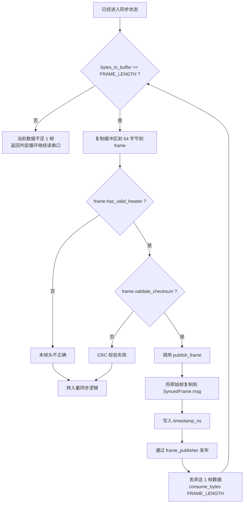

# 已同步后的处理

这张图描述 `is_synced == true` 后的主处理逻辑。

## 这里做了什么

- 一旦同步建立，程序就不再按字节扫描
- 而是直接按固定帧长 `64` 字节切帧
- 每一帧都做两层检查：
  - 帧头是否为 `EB 90`
  - CRC 是否等于前 `63` 字节累加和

## 为什么同步后还要再次检查

因为串口流中仍可能出现：

- 丢字节
- 插入干扰字节
- 设备重启后半帧数据

所以即使已经同步，也不能盲信每一帧都一定正确。
