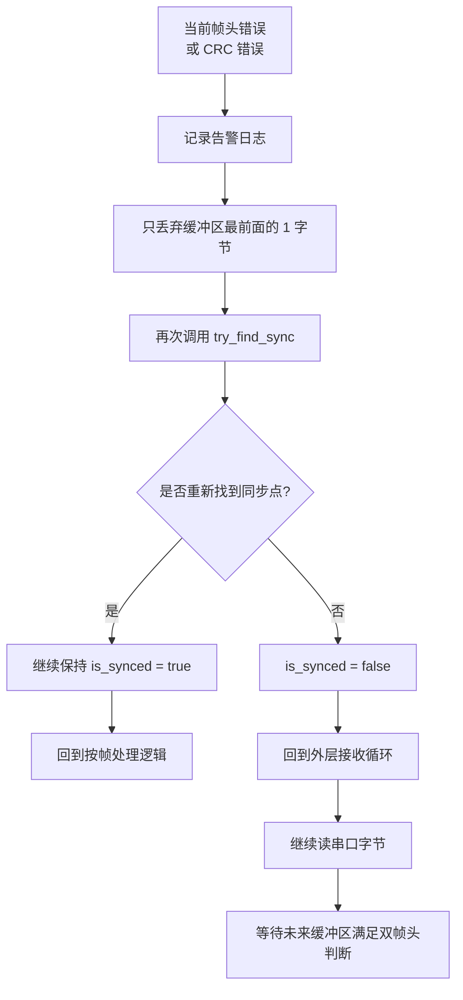

# 校验失败后的重同步

这张图描述已经同步后，如果发现帧头错误或 CRC 错误，程序如何恢复同步。

## 为什么只丢 1 字节

如果直接丢整帧，风险很大：

- 当前这帧也许只是开头错位了 1 个字节
- 真实帧头可能就在下一个字节处

所以这里采用更稳妥的办法：

- 每次失败只右移 `1` 字节
- 再重新用“双帧头”规则寻找同步点

这种方式虽然保守，但更不容易跳过真正的有效帧。
