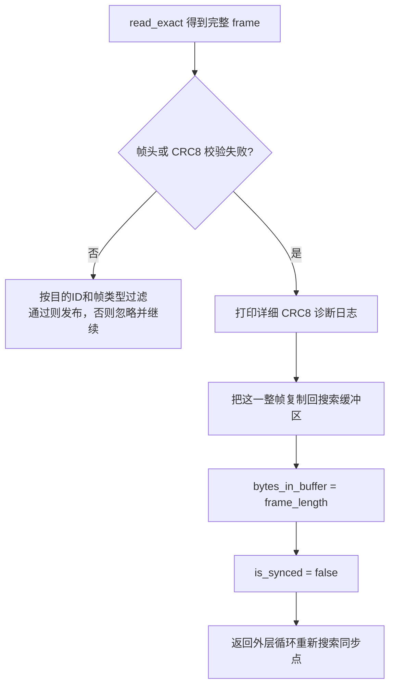
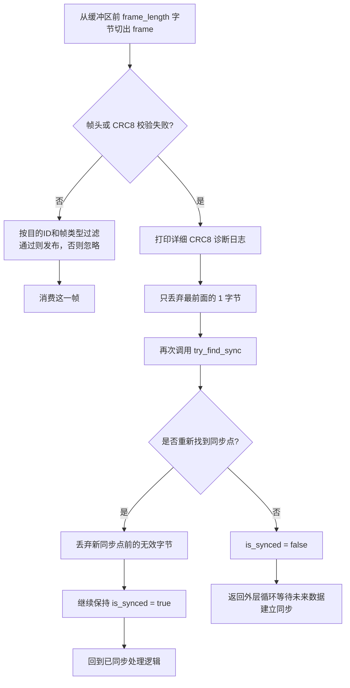

# 校验失败后的重同步

当前实现里，校验失败后的恢复分成两种情况。

## 情况 1：固定 `frame_length` 直接读帧时失败

```mermaid
flowchart TB
    A[read_exact 得到完整 frame] --> B{帧头或 CRC8 校验失败?}
    B -- 否 --> C[按目的ID和帧类型过滤<br/>通过则发布，否则忽略并继续]
    B -- 是 --> D[打印详细 CRC8 诊断日志]
    D --> E[把这一整帧复制回搜索缓冲区]
    E --> F[bytes_in_buffer = frame_length]
    F --> G[is_synced = false]
    G --> H[返回外层循环重新搜索同步点]
```

## 情况 2：从用户态缓冲区切帧时失败

```mermaid
flowchart TB
    A[从缓冲区前 frame_length 字节切出 frame] --> B{帧头或 CRC8 校验失败?}
    B -- 否 --> C[按目的ID和帧类型过滤<br/>通过则发布，否则忽略]
    C --> C1[消费这一帧]
    B -- 是 --> D[打印详细 CRC8 诊断日志]
    D --> E[只丢弃最前面的 1 字节]
    E --> F[再次调用 try_find_sync]
    F --> G{是否重新找到同步点?}
    G -- 是 --> H[丢弃新同步点前的无效字节]
    H --> I[继续保持 is_synced = true]
    I --> J[回到已同步处理逻辑]
    G -- 否 --> K[is_synced = false]
    K --> L[返回外层循环等待未来数据建立同步]
```
