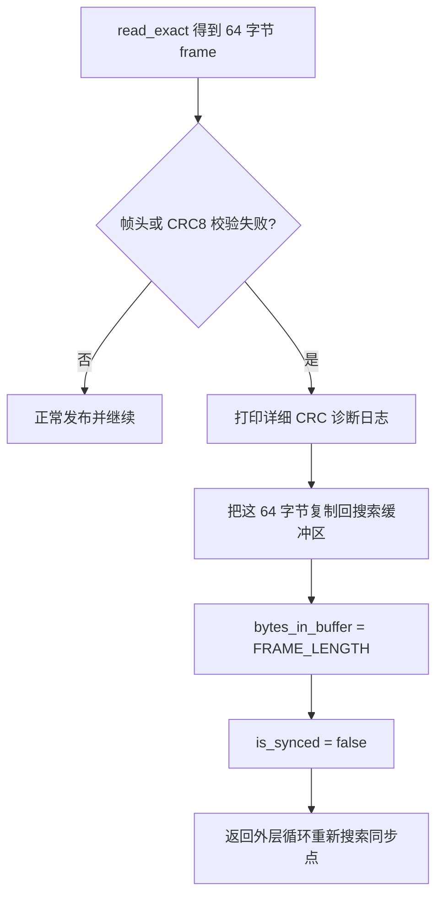
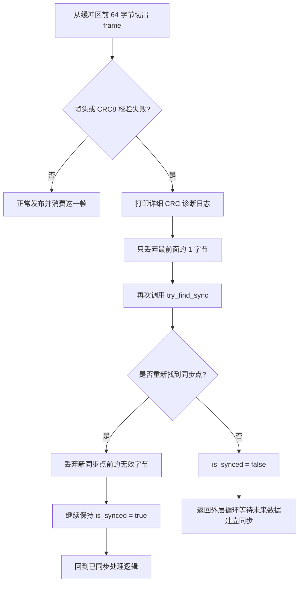

# 校验失败后的重同步

当前实现里，校验失败后的恢复分成两种情况。

## 情况 1：固定 64 字节直接读帧时失败

也就是 `bytes_in_buffer == 0`，程序刚用 `read_exact()` 读满一整帧。

## 情况 2：从用户态缓冲区切帧时失败

也就是 `bytes_in_buffer > 0`，程序正在处理缓冲区前部已有的数据。

## 为什么这里分成两种恢复方式

- 在固定 `64` 字节直读模式下，当前这整帧刚从内核读出来，最稳妥的做法是把它整体放回搜索缓冲区，重新按“双帧头”规则判断
- 在缓冲区切帧模式下，前面可能只是错位了 `1` 个字节，因此只丢 `1` 字节更不容易跳过真正的帧头

## 诊断日志会输出什么

当前代码在校验失败时会同时输出：

- 当前配置的 CRC8 变体
- 收到的 CRC8 值
- `crc8` / `maxim` / `sae_j1850` 的计算结果
- 整帧 `64` 字节十六进制内容

这对排查“帧头对了但 CRC 参数不对”的问题很有帮助。
