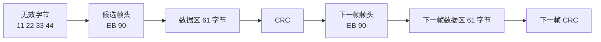

# 字节流示例

这张图用一个简化字节流示例说明为什么“双帧头同步”比“单帧头同步”更可靠。

## 程序如何判断

程序不会只看到第一个 `EB 90` 就认定同步成功，而是会继续检查：

- 当前位置是否是 `EB 90`
- `当前位置 + 64` 是否还是 `EB 90`

如果这两个条件都成立，就说明：

- 这个位置大概率是真实帧起点
- 后面那一个位置大概率是真实下一帧起点

所以程序才会把前面的无效字节全部丢掉，进入同步状态。
